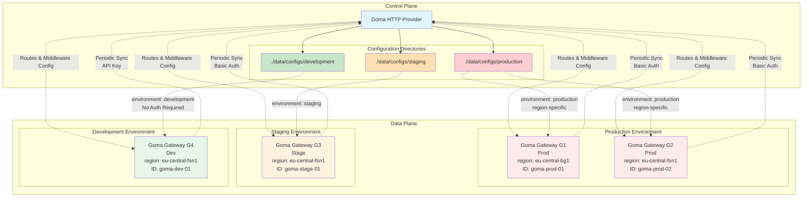

# Goma HTTP Provider

The **Goma HTTP Provider** is a centralized configuration service designed for **Goma Gateway** deployments. It allows multiple gateway instances to dynamically fetch their configuration over HTTP, based on **authentication** and **request metadata**.

By separating configuration delivery from gateway runtime, Goma HTTP Provider makes it easy to manage **environment-specific** configurations (production, staging, development, etc.) from a single control plane.

[](https://github.com/jkaninda/goma-http-provider/actions/workflows/tests.yml)
[](https://github.com/jkaninda/pg-bkup/actions/workflows/release.yaml)
[](https://goreportcard.com/report/github.com/jkaninda/goma-http-provider)


### What It Does

* Serves Goma Gateway configurations from multiple directories
* Selects the correct configuration using request metadata (headers)
* Supports secure access via multiple authentication mechanisms
* Enables dynamic, environment-aware configuration delivery
* Works seamlessly with containerized and cloud-native setups


## Key Features

* **Multi-directory configuration support**
  Serve configurations from different directories mapped to environments.

* **Metadata-based environment resolution**
  Automatically select the appropriate configuration using request headers.

* **Multiple authentication methods**

  * API Key
  * Basic Authentication
  * Header-based metadata validation

* **Optional default configuration**
  Allow unauthenticated access when no metadata or auth is required.

* **Docker-ready**
  Easily deploy using Docker or container orchestration platforms.

* **Built-in OpenAPI / Swagger documentation**
  Explore and test the API interactively.

> ⚠️ Even if authentication succeeds, **metadata must match** the configuration definition for access to be granted (unless the configuration is marked as `default`).

## Architecture Overview

The diagram below illustrates how **Goma HTTP Provider** acts as a control plane, serving configurations to multiple **Goma Gateway** instances across different environments.




## Supported Authentication Methods

Goma HTTP Provider supports flexible access control using one or more of the following:

* **API Key**
* **Basic Authentication**
* **Request metadata headers**

Authentication and metadata checks can be combined to ensure that only authorized gateways can retrieve the correct configuration for their environment.

## Links

- **Gateway**: [Goma Gateway on GitHub](https://github.com/jkaninda/goma-gateway)
- **Source Code**: [goma-http-provider](https://github.com/jkaninda/goma-http-provider)
- **Docker Image**: [jkaninda/goma-http-provider](https://hub.docker.com/r/jkaninda/goma-http-provider)


## Metadata Handling

Metadata is used to select the appropriate configuration.

If a configuration defines the metadata key `environment`, the incoming HTTP request **must include** the corresponding header:

```
X-Goma-Meta-Environment: production
```

### Metadata Header Rules

- All metadata headers **must be prefixed** with:
  `X-Goma-Meta-`
- Metadata keys are **case-insensitive**
- Metadata **must match exactly** unless the configuration is marked as `default`

---

## API Endpoints

The Goma HTTP Provider exposes the following HTTP endpoints:

| Method | Endpoint                | Description                                                                     |
| ------ | ----------------------- | ------------------------------------------------------------------------------- |
| `GET`  | `/api/v1/config`        | Retrieve the gateway configuration based on request metadata and authentication |
| `POST` | `/api/v1/config/reload` | Reload the configuration for the matching environment (based on metadata)       |
| `GET`  | `/api/v1/config/stats`  | Get statistics for the selected configuration                                   |
| `GET`  | `/healthz`              | Health check endpoint                                                           |

### Metadata-Based Resolution

All `/api/v1/config*` endpoints:

- Require **valid authentication** (unless the configuration is marked as `default`)
- Match configurations using request metadata headers (`X-Goma-Meta-*`)
- Return the configuration associated with the matching environment

---

## Environment Variables

The following environment variables can be used to configure the Goma HTTP Provider:

| Variable        | Description                                           | Default    |
| --------------- | ----------------------------------------------------- | ---------- |
| `PORT`          | Port the HTTP server listens on                       | `8080`     |
| `ENABLE_DOCS`   | Enable or disable the Swagger / OpenAPI documentation | `true`     |
| `TLS_CERT_PATH` | Path to the TLS certificate file (PEM format)         | _disabled_ |
| `TLS_KEY_PATH`  | Path to the TLS private key file (PEM format)         | _disabled_ |

### Server Port

By default, the server runs on port **8080**.
You can override it using the `PORT` environment variable:

```sh
export PORT=9000
```

> CLI flags (e.g. `--port`) typically take precedence over environment variables, if both are set.

### TLS Configuration

To enable HTTPS, both `TLS_CERT_PATH` and `TLS_KEY_PATH` **must be set**:

```sh
export TLS_CERT_PATH=/etc/ssl/certs/server.crt
export TLS_KEY_PATH=/etc/ssl/private/server.key
```

If one of the values is missing, the server falls back to **HTTP**.

### API Documentation

The OpenAPI specification is automatically generated from the application configuration.

Swagger UI is enabled by default. To disable it:

```sh
export ENABLE_DOCS=false
```

## Local Development

```sh
# Clone the repository
git clone https://github.com/jkaninda/goma-http-provider
cd goma-http-provider

# Install dependencies
go mod tidy

# Run the application
go run cmd/main.go --config data/config.yaml
```

### Configuration

- Default port: **8080**
- Override port:

  ```sh
  go run cmd/main.go --config data/config.yaml --port 9000
  ```

### Available Endpoints

- Server: `http://localhost:8080`
- API Docs (Swagger UI):
  `http://localhost:8080/docs`

---

## 🐳 Docker Deployment

```sh
docker run --rm --name goma-http-provider \
  -p 8080:8080 \
  -v ./data:/data \
  jkaninda/goma-http-provider \
  --config /data/config.yaml
```

## Configuration Example

```yaml
configurations:
  - directory: ./data/configs/production
    default: false
    metadata:
      environment: production
      region: eu-central-bg1
      gateway-id: goma-prod-01
    auth:
      basicAuth:
        username: admin
        password: "change me"

  - directory: ./data/configs/staging
    metadata:
      environment: staging
      region: eu-central-fsn1
      gateway-id: goma-stage-01
    auth:
      basicAuth:
        username: admin
        password: staging-pass

  - directory: ./data/configs/development
    default: true
    metadata:
      environment: dev
      region: eu-central-fsn1
      gateway-id: goma-dev-01
    auth: {} # No authentication required
    # auth:
    #   apiKey: dev-secret-key-123
```

### Notes

- When `default: true`:
  - Authentication is **not required**
  - Metadata is **ignored**

- Only **one configuration** should be marked as default

## Goma Gateway HTTP Provider Configuration

```yaml
gateway:
  providers:
    http:
      enabled: true
      endpoint: "https://config.example.com/api/v1/config"
      interval: 60s
      timeout: 10s
      retryAttempts: 5
      retryDelay: 3s
      cacheDir: "" # Defaults to /tmp/goma/cache/config.json
      insecureSkipVerify: false
      headers:
        X-Goma-Meta-Gateway-Id: goma-prod-01
        X-Goma-Meta-Region: eu-central-bg1
        X-Goma-Meta-Environment: production
        Authorization: "${GOMA_PROD_AUTHORIZATION}"
        # X-API-Key: xxxxxx-xxxxx-xxxx
```

---

## License

[MIT](LICENSE) — Free to use, modify, and distribute.

---

## © Copyright

Copyright (c) 2026
**Jonas Kaninda**
